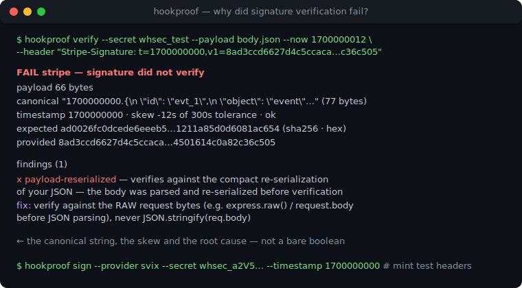
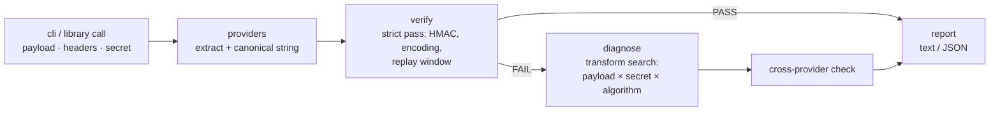

# hookproof

[English](README.md) | [中文](README.zh.md) | [日本語](README.ja.md)

[](LICENSE)  [](CHANGELOG.md)  [](CONTRIBUTING.md)

**hookproof：Stripe・GitHub・Slack・Svix・Standard Webhooks に対応したオープンソースの webhook 署名ツールキット——素っ気ない boolean の代わりに、正規化文字列・タイムスタンプのずれ・エンコーディング不一致を示す、診断ファーストの検証。**



```bash
git clone https://github.com/JaydenCJ/hookproof.git && cd hookproof && npm install && npm run build
```

> プレリリース：v0.1.0 はまだ npm に公開されていません。上記のとおりソースから実行してください（`node dist/cli.js`、またはグローバルの `hookproof` には `npm link`）。ランタイム依存はゼロです。

## なぜ hookproof？

「署名検証に失敗しました」は webhook 統合者の通過儀礼であり、エラーはいつも同じ情報量ゼロの boolean です。実際の原因は地味で目に見えません：body parser が MAC 計算前に JSON を再シリアライズした、プロキシが CRLF を書き換えた、`echo` が改行を足した、`whsec_` プレフィックスが剥がされた（Stripe は保持を要求し、Svix はプレフィックス以降の base64 デコードを要求する）、hex が期待される場所にダイジェストが base64 で届いた、あるいは時計が 6 分ずれている。各社の SDK は自社方式しか検証せず合否だけを返し、あなたはバイト列を手で二分探索するはめになります。hookproof は 5 方式すべてを厳密に実装し、失敗時にはペイロード変換・シークレット解釈・エンコーディング・アルゴリズムの有界探索を行い——MAC を一致させる最小の変更を証明として報告し、何が署名されたのか見えるよう正確な正規化文字列とずれを表示します。さらに全方式の正当なヘッダを生成できるので、決定的なフィクスチャでエンドポイントをオフラインでテストできます。

| | hookproof | 各社 SDK（stripe・@octokit/webhooks-methods・svix） | standard-webhooks ライブラリ | 手書き HMAC |
| --- | --- | --- | --- | --- |
| 対応方式 | Stripe・GitHub・Slack・Svix・Standard Webhooks | 各 1 方式 | Standard Webhooks のみ | 書いた分だけ |
| 失敗時の出力 | 正規化文字列・ずれ・期待値 vs 実際値・根本原因 findings | boolean / 汎用例外 | boolean / 例外 | `console.log` 考古学 |
| 診断 | 候補変換で再計算して根本原因を証明 | なし | なし | なし |
| テスト用ヘッダ生成 | 全 5 方式、固定タイムスタンプで決定的 | 部分的（一部 SDK） | 自方式の署名のみ | 自作 |
| ヘッダから方式検出 | 対応、確信度つき | 非対応 | 非対応 | 非対応 |
| ランタイム依存 | ゼロ（node:crypto + 手書きコーデック） | SDK 全面積 | 小さい | ゼロ |

<sub>比較は 2026-07 時点の各上流ドキュメントに基づく。統合が*完成した後*は各社 SDK が正解です。hookproof は動くまでの数時間のため——そしてその後フィクスチャを鋳造するためにあります。</sub>

## 機能

- **5 方式を忠実に実装** — Stripe `t=/v1=`、GitHub `sha256=`（レガシー SHA-1 も認識）、Slack `v0:{ts}:{body}`、Svix と Standard Webhooks の `v1,` base64 とデコード済み `whsec_` 鍵。定数時間比較と方式ごとのリプレイ窓。
- **占いではなく診断** — すべての finding は候補解釈下でのバイト一致 HMAC 再計算により証明されます：末尾改行、CRLF↔LF、UTF-8 BOM、再シリアライズされた JSON、シークレットの空白、`whsec_` プレフィックス混同、base64/hex/base64url の取り違え、SHA-1/512 混同、切り詰められた値。
- **過程を見せる** — レポートは不可視バイトをエスケープした正確な正規化文字列、ペイロードのバイト数、許容値に対するタイムスタンプのずれ、期待 vs 実際の署名を表示。スクリプト向け `--json`、grep 可能な 20 個の安定 finding id。
- **プロバイダ横断検出** — `detect` は任意のヘッダ集合から方式を特定し（curl -v の写しも可）、`verify` は他の全方式との照合で「これは GitHub のヘッダなのに Stripe を選んだ」を捕まえます。
- **検証だけでなく生成も** — `sign` は任意のペイロード/シークレット/タイムスタンプに正当なヘッダを鋳造し、webhook エンドポイントを決定的フィクスチャでオフラインにテスト可能に。テスト用時計はどこでも注入可能（`--now`）。
- **依存ゼロ、ネットワークゼロ** — node:crypto の HMAC と、テストで Buffer と相互検証される手書きコーデック。hookproof は文字列を読み文字列を印字するだけで、90 個のオフラインテストとエンドツーエンドのスモークスクリプトで検証済み。

## クイックスタート

キャプチャした Stripe 配信を検証する（ペイロードファイル + 貼り付けたヘッダ）——以下の再現はそのままコピペで実行できます：

```bash
printf '{\n  "id": "evt_1",\n  "object": "event",\n  "type": "invoice.paid"\n}' > body.json
hookproof verify --secret whsec_test --payload body.json --now 1700000012 \
  --header "Stripe-Signature: t=1700000000,v1=8ad3ccd6627d4c5ccaca4879744c3321eb0c9d89da2714501614c0a82c36c505"
```

実際のキャプチャ出力——古典的な body-parser バグを現行犯逮捕：

```text
FAIL  stripe — signature did not verify
  payload    66 bytes
  canonical  "1700000000.{\n  \"id\": \"evt_1\",\n  \"object\": \"event\",\n  \"type\": \"invoice.paid\"\n}" (77 bytes)
  timestamp  1700000000 · skew -12s of 300s tolerance · ok
  expected   ad0026fc0dcede6eeeb5…1211a85d0d6081ac654 (sha256 · hex)
  provided   8ad3ccd6627d4c5ccaca…4501614c0a82c36c505

  findings (1)
  x payload-reserialized — verifies against the compact re-serialization of your JSON — the body was parsed and re-serialized before verification
      fix: verify against the RAW request bytes (e.g. express.raw() / request.body before JSON parsing), never JSON.stringify(req.body)
```

ダッシュボード不要で、自分のエンドポイントをテストする正当なヘッダを鋳造：

```bash
printf '%s' '{"id":"evt_1"}' | hookproof sign --provider svix \
  --secret whsec_c21va2Uta2V5 --timestamp 1700000000 --id msg_1
```

```text
svix-id: msg_1
svix-timestamp: 1700000000
svix-signature: v1,3V9toTQfHVT1bqRAG2TCH8iJqj2c9ktc+00BqBdjeK8=
```

## コマンドと終了コード

| コマンド | 内容 | 終了コード |
| --- | --- | --- |
| `verify` | 厳密検証 + 失敗時の診断。`--provider` 省略時はヘッダから自動検出 | 0 検証成功 · 1 失敗 · 2 使用法エラー |
| `sign` | ペイロードに正当な署名ヘッダを鋳造（`--timestamp`・`--id` で決定的に） | 0 · 2 使用法エラー |
| `detect` | ヘッダ集合に現れる方式を確信度つきで報告 | 0 検出 · 1 なし · 2 使用法エラー |
| `providers` | 5 方式のリファレンス表（ヘッダ・正規化文字列・シークレット・許容値） | 0 |

主なフラグ：`--payload <file>`（または stdin）、繰り返せる `--header "Name: value"`、ブロック貼り付け用 `--headers <file>`、シークレットをシェル履歴に残さない `--secret-file`、時計を固定する `--now <epoch>`、`--tolerance <secs>`、`--json`、`--no-diagnose`。方式リファレンス全文と 20 finding のカタログは [docs/providers.md](docs/providers.md) に。

## ライブラリ API

```js
import { verify, signRequest, detectProviders } from "hookproof";

const report = verify({
  provider: "stripe",
  secret: process.env.WEBHOOK_SECRET,
  payload: rawBody,            // the raw request bytes, as a string
  headers: req.headers,        // names matched case-insensitively
  now: 1700000012,             // optional: pin the clock for replayed captures
});
// report.ok, report.canonical.value, report.timestamp.skewSeconds,
// report.findings: [{ id, severity, message, fix }, …]
```

あらゆる問題はレポート内の finding になります——`verify` は不正な入力で例外を投げません。`signRequest` はそのまま送れる `{ name, value }` ヘッダと、MAC 対象となった正規化文字列を返します。

## アーキテクチャ



厳密検証パスはプロバイダ自身の SDK と完全に一致します。寛容な解釈はすべて診断エンジン内に住み、finding として明示されます。プロバイダは「データ + 関数」型の spec なので、方式の追加はファイル 1 つとそのテストで済みます。

## ロードマップ

- [x] v0.1.0 — 5 方式（検証 + 署名）、20 finding id の診断エンジン、プロバイダ横断検出、正規化文字列レポート、JSON 出力、依存ゼロ、90 テスト + スモークスクリプト
- [ ] バイナリセーフなペイロード（`--payload-base64`）で非 UTF-8 ボディに対応
- [ ] 方式追加：Shopify・Twilio・PayPal・WooCommerce
- [ ] Svix `v1a`（ed25519）非対称検証
- [ ] `hookproof listen` — リプレイ可能なフィクスチャを書き出すローカル捕獲エンドポイント
- [ ] シークレット供給ヘルパー（環境変数の間接参照）で argv から完全に排除

全リストは [open issues](https://github.com/JaydenCJ/hookproof/issues) を参照。

## コントリビュート

バグ報告・新方式の提案・pull request を歓迎します——ローカルのワークフローは [CONTRIBUTING.md](CONTRIBUTING.md) を参照（`npm test` と、`SMOKE OK` を印字する `scripts/smoke.sh`）。入門タスクには [good first issue](https://github.com/JaydenCJ/hookproof/issues?q=is%3Aissue+is%3Aopen+label%3A%22good+first+issue%22) ラベルが付き、設計の議論は [Discussions](https://github.com/JaydenCJ/hookproof/discussions) で。

## ライセンス

[MIT](LICENSE)
