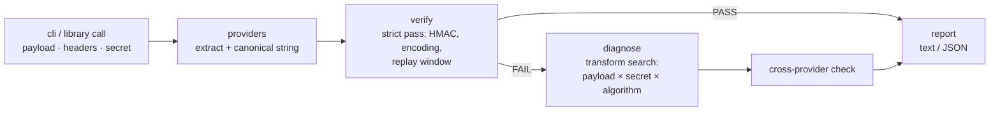

# hookproof

[English](README.md) | [中文](README.zh.md) | [日本語](README.ja.md)

[](LICENSE)  [](CHANGELOG.md)  [](CONTRIBUTING.md)

**hookproof：an open-source webhook signature toolkit for Stripe, GitHub, Slack, Svix and Standard Webhooks — diagnosis-first verification that shows the canonical string, timestamp skew and encoding mismatches instead of a bare boolean.**


```bash
git clone https://github.com/JaydenCJ/hookproof.git && cd hookproof && npm install && npm run build
```

> Pre-release: v0.1.0 is not yet published to npm; run from source as above (`node dist/cli.js` or `npm link` for a global `hookproof`). Zero runtime dependencies.

## Why hookproof?

"Signature verification failed" is a rite of passage for webhook integrators, and the error is always the same unhelpful boolean. The actual causes are mundane and invisible: a body parser re-serialized the JSON before you MACed it, a proxy rewrote CRLF, `echo` appended a newline, the `whsec_` prefix was stripped (Stripe wants it kept; Svix wants the part after it base64-decoded), the digest arrived base64 where hex was expected, or the clock is 6 minutes off. Provider SDKs verify only their own scheme and return pass/fail; you are left bisecting bytes by hand. hookproof implements all five schemes strictly, and on failure runs a bounded search over payload transforms, secret interpretations, encodings and algorithms — reporting the minimal change that makes the MAC match, as proof, with the exact canonical string and skew printed so you can see what was signed. It also generates valid headers for every scheme, so endpoints are testable offline with deterministic fixtures.

| | hookproof | provider SDKs (stripe, @octokit/webhooks-methods, svix) | standard-webhooks libs | hand-rolled HMAC |
| --- | --- | --- | --- | --- |
| Schemes covered | Stripe, GitHub, Slack, Svix, Standard Webhooks | one each | Standard Webhooks only | whatever you wrote |
| Failure output | canonical string, skew, expected vs provided, root-cause findings | boolean / generic exception | boolean / exception | `console.log` archaeology |
| Diagnosis | proves root cause by recomputing under candidate transforms | none | none | none |
| Generate test headers | all five schemes, fixed timestamp for determinism | partial (some SDKs) | sign only your scheme | DIY |
| Detect scheme from headers | yes, with confidence | n/a | n/a | n/a |
| Runtime dependencies | none (node:crypto + hand-rolled codecs) | full SDK surface | small | none |

<sub>Comparison reflects upstream documentation as of 2026-07. Provider SDKs are the right choice *inside* the finished integration; hookproof is for the hours before it works — and for minting fixtures after.</sub>

## Features

- **Five schemes, implemented faithfully** — Stripe `t=/v1=`, GitHub `sha256=` (+ legacy SHA-1 awareness), Slack `v0:{ts}:{body}`, Svix and Standard Webhooks `v1,` base64 with decoded `whsec_` keys; constant-time comparison and per-scheme replay windows.
- **Diagnosis, not divination** — every finding is proven by a byte-exact HMAC recomputation under the candidate interpretation: trailing newline, CRLF↔LF, UTF-8 BOM, re-serialized JSON, secret whitespace, `whsec_` prefix confusion, base64/hex/base64url mix-ups, SHA-1/512 confusion, truncated values.
- **Shows its work** — reports print the exact canonical string with invisible bytes escaped, payload byte counts, timestamp skew against tolerance, and expected vs provided signatures; `--json` for scripts, 20 stable greppable finding ids.
- **Cross-provider detection** — `detect` names the scheme from any header bag (curl -v transcripts accepted), and `verify` catches "these are GitHub headers, you picked Stripe" by verifying against every other scheme.
- **Generates as well as verifies** — `sign` mints valid headers for any payload/secret/timestamp, making webhook endpoints testable offline with deterministic fixtures; the test clock is injectable everywhere (`--now`).
- **Zero dependencies, zero network** — node:crypto HMAC plus hand-rolled codecs cross-checked against Buffer in the suite; hookproof reads strings and prints strings, verified by 90 offline tests and an end-to-end smoke script.

## Quickstart

Verify a captured Stripe delivery (payload file + pasted header) — this exact repro is copy-paste runnable:

```bash
printf '{\n  "id": "evt_1",\n  "object": "event",\n  "type": "invoice.paid"\n}' > body.json
hookproof verify --secret whsec_test --payload body.json --now 1700000012 \
  --header "Stripe-Signature: t=1700000000,v1=8ad3ccd6627d4c5ccaca4879744c3321eb0c9d89da2714501614c0a82c36c505"
```

Real captured output — the classic body-parser bug, caught:

```text
FAIL  stripe — signature did not verify
  payload    66 bytes
  canonical  "1700000000.{\n  \"id\": \"evt_1\",\n  \"object\": \"event\",\n  \"type\": \"invoice.paid\"\n}" (77 bytes)
  timestamp  1700000000 · skew -12s of 300s tolerance · ok
  expected   ad0026fc0dcede6eeeb5…1211a85d0d6081ac654 (sha256 · hex)
  provided   8ad3ccd6627d4c5ccaca…4501614c0a82c36c505

  findings (1)
  x payload-reserialized — verifies against the compact re-serialization of your JSON — the body was parsed and re-serialized before verification
      fix: verify against the RAW request bytes (e.g. express.raw() / request.body before JSON parsing), never JSON.stringify(req.body)
```

Mint valid headers to test your own endpoint, no dashboard required:

```bash
printf '%s' '{"id":"evt_1"}' | hookproof sign --provider svix \
  --secret whsec_c21va2Uta2V5 --timestamp 1700000000 --id msg_1
```

```text
svix-id: msg_1
svix-timestamp: 1700000000
svix-signature: v1,3V9toTQfHVT1bqRAG2TCH8iJqj2c9ktc+00BqBdjeK8=
```

## Commands and exit codes

| Command | Does | Exits |
| --- | --- | --- |
| `verify` | strict verification + diagnosis on failure; auto-detects the provider from headers when `--provider` is omitted | 0 verified · 1 failed · 2 usage |
| `sign` | mint valid signature headers for a payload (`--timestamp`, `--id` for determinism) | 0 · 2 usage |
| `detect` | name the scheme(s) present in a header bag, with confidence | 0 found · 1 none · 2 usage |
| `providers` | the five-scheme reference table (headers, canonical strings, secrets, tolerances) | 0 |

Key flags: `--payload <file>` (or stdin), repeatable `--header "Name: value"`, `--headers <file>` for pasted blocks, `--secret-file` to keep secrets out of shell history, `--now <epoch>` to pin the clock, `--tolerance <secs>`, `--json`, `--no-diagnose`. The full scheme reference and the 20-finding catalog live in [docs/providers.md](docs/providers.md).

## Library API

```js
import { verify, signRequest, detectProviders } from "hookproof";

const report = verify({
  provider: "stripe",
  secret: process.env.WEBHOOK_SECRET,
  payload: rawBody,            // the raw request bytes, as a string
  headers: req.headers,        // names matched case-insensitively
  now: 1700000012,             // optional: pin the clock for replayed captures
});
// report.ok, report.canonical.value, report.timestamp.skewSeconds,
// report.findings: [{ id, severity, message, fix }, …]
```

Every problem becomes a finding in the report — `verify` never throws on bad input. `signRequest` returns ready-to-send `{ name, value }` headers plus the canonical string it MACed.

## Architecture



The strict pass mirrors the provider's own SDK exactly; every forgiving interpretation lives in the diagnosis engine and is labelled as a finding. Providers are data-plus-functions specs, so adding a scheme touches one file plus its tests.

## Roadmap

- [x] v0.1.0 — five schemes (verify + sign), diagnosis engine with 20 finding ids, cross-provider detection, canonical-string reports, JSON output, zero dependencies, 90 tests + smoke script
- [ ] Binary-safe payloads (`--payload-base64`) for non-UTF-8 bodies
- [ ] More schemes: Shopify, Twilio, PayPal, WooCommerce
- [ ] Svix `v1a` (ed25519) asymmetric verification
- [ ] `hookproof listen` — a local capture endpoint that writes replayable fixtures
- [ ] Secret-source helpers (env indirection) to keep secrets off argv entirely

See the [open issues](https://github.com/JaydenCJ/hookproof/issues) for the full list.

## Contributing

Bug reports, new-scheme proposals and pull requests are welcome — see [CONTRIBUTING.md](CONTRIBUTING.md) for the local workflow (`npm test` plus `scripts/smoke.sh` printing `SMOKE OK`). Good entry points are labelled [good first issue](https://github.com/JaydenCJ/hookproof/issues?q=is%3Aissue+is%3Aopen+label%3A%22good+first+issue%22), and design questions live in [Discussions](https://github.com/JaydenCJ/hookproof/discussions).

## License

[MIT](LICENSE)
