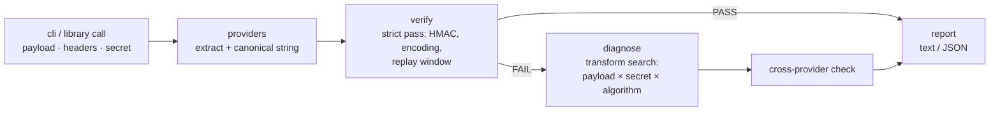

# hookproof

[English](README.md) | [中文](README.zh.md) | [日本語](README.ja.md)

[](LICENSE)  [](CHANGELOG.md)  [](CONTRIBUTING.md)

**hookproof：面向 Stripe、GitHub、Slack、Svix 与 Standard Webhooks 的开源 webhook 签名工具箱——以诊断为先的校验，展示规范化字符串、时间戳偏移与编码错配，而不是一个干巴巴的布尔值。**


```bash
git clone https://github.com/JaydenCJ/hookproof.git && cd hookproof && npm install && npm run build
```

> 预发布：v0.1.0 尚未发布到 npm；请按上述方式从源码运行（`node dist/cli.js`，或 `npm link` 获得全局 `hookproof`）。零运行时依赖。

## 为什么选 hookproof？

“签名校验失败”是每个 webhook 集成者的成人礼，而报错永远是同一个毫无信息量的布尔值。真正的原因平凡且不可见：body parser 在你计算 MAC 之前重新序列化了 JSON，代理改写了 CRLF，`echo` 追加了换行符，`whsec_` 前缀被剥掉（Stripe 要求保留；Svix 要求把前缀之后的部分做 base64 解码），摘要以 base64 送达而期望的是 hex，或者时钟偏了 6 分钟。各家 SDK 只校验自家方案并返回通过/失败；你只能徒手对字节做二分。hookproof 严格实现全部五种方案，失败时在负载变换、密钥解释、编码与算法上做有界搜索——以证明的方式报告使 MAC 匹配的最小改动，并打印出精确的规范化字符串与偏移量，让你看见被签名的到底是什么。它还能为每种方案生成合法请求头，让端点可以用确定性夹具离线测试。

| | hookproof | 各家 SDK（stripe、@octokit/webhooks-methods、svix） | standard-webhooks 库 | 手写 HMAC |
| --- | --- | --- | --- | --- |
| 覆盖方案 | Stripe、GitHub、Slack、Svix、Standard Webhooks | 各自一种 | 仅 Standard Webhooks | 你写了什么就是什么 |
| 失败输出 | 规范化字符串、偏移量、期望值 vs 实际值、根因 findings | 布尔值 / 泛化异常 | 布尔值 / 异常 | `console.log` 考古 |
| 诊断 | 在候选变换下重算以证明根因 | 无 | 无 | 无 |
| 生成测试请求头 | 全部五种方案，固定时间戳保证确定性 | 部分（个别 SDK） | 只签自家方案 | 自己动手 |
| 从请求头识别方案 | 支持，带置信度 | 不适用 | 不适用 | 不适用 |
| 运行时依赖 | 零（node:crypto + 手写编解码器） | 完整 SDK 面积 | 较小 | 零 |

<sub>对比基于 2026-07 各上游文档。集成*完成后*，各家 SDK 是正确选择；hookproof 服务于它能跑通之前的那些小时——以及之后铸造夹具的时刻。</sub>

## 功能特性

- **五种方案，忠实实现** — Stripe `t=/v1=`、GitHub `sha256=`（并识别遗留 SHA-1）、Slack `v0:{ts}:{body}`、Svix 与 Standard Webhooks 的 `v1,` base64 及解码后的 `whsec_` 密钥；常量时间比较与各方案的重放窗口。
- **诊断，而非占卜** — 每条 finding 都由候选解释下逐字节精确的 HMAC 重算来证明：尾部换行、CRLF↔LF、UTF-8 BOM、重序列化的 JSON、密钥空白符、`whsec_` 前缀混淆、base64/hex/base64url 错配、SHA-1/512 混淆、被截断的值。
- **把过程亮出来** — 报告打印精确的规范化字符串（不可见字节转义显示）、负载字节数、相对容差的时间戳偏移、期望 vs 实际签名；`--json` 供脚本使用，20 个稳定可 grep 的 finding id。
- **跨供应商检测** — `detect` 从任意请求头集合识别方案（可直接粘贴 curl -v 输出），`verify` 通过对照其他所有方案捕捉“这是 GitHub 的头，你却选了 Stripe”。
- **既能校验也能生成** — `sign` 为任意负载/密钥/时间戳铸造合法请求头，让 webhook 端点用确定性夹具离线测试；测试时钟处处可注入（`--now`）。
- **零依赖，零网络** — node:crypto HMAC 加上在测试中与 Buffer 交叉验证的手写编解码器；hookproof 只读字符串、只打印字符串，由 90 个离线测试与端到端冒烟脚本验证。

## 快速上手

校验一次捕获的 Stripe 投递（负载文件 + 粘贴的请求头）——下面的复现可以原样复制运行：

```bash
printf '{\n  "id": "evt_1",\n  "object": "event",\n  "type": "invoice.paid"\n}' > body.json
hookproof verify --secret whsec_test --payload body.json --now 1700000012 \
  --header "Stripe-Signature: t=1700000000,v1=8ad3ccd6627d4c5ccaca4879744c3321eb0c9d89da2714501614c0a82c36c505"
```

真实捕获输出——经典的 body-parser bug，当场抓获：

```text
FAIL  stripe — signature did not verify
  payload    66 bytes
  canonical  "1700000000.{\n  \"id\": \"evt_1\",\n  \"object\": \"event\",\n  \"type\": \"invoice.paid\"\n}" (77 bytes)
  timestamp  1700000000 · skew -12s of 300s tolerance · ok
  expected   ad0026fc0dcede6eeeb5…1211a85d0d6081ac654 (sha256 · hex)
  provided   8ad3ccd6627d4c5ccaca…4501614c0a82c36c505

  findings (1)
  x payload-reserialized — verifies against the compact re-serialization of your JSON — the body was parsed and re-serialized before verification
      fix: verify against the RAW request bytes (e.g. express.raw() / request.body before JSON parsing), never JSON.stringify(req.body)
```

铸造合法请求头来测试你自己的端点，不需要任何控制台：

```bash
printf '%s' '{"id":"evt_1"}' | hookproof sign --provider svix \
  --secret whsec_c21va2Uta2V5 --timestamp 1700000000 --id msg_1
```

```text
svix-id: msg_1
svix-timestamp: 1700000000
svix-signature: v1,3V9toTQfHVT1bqRAG2TCH8iJqj2c9ktc+00BqBdjeK8=
```

## 命令与退出码

| 命令 | 作用 | 退出码 |
| --- | --- | --- |
| `verify` | 严格校验 + 失败时诊断；省略 `--provider` 时从请求头自动识别 | 0 通过 · 1 失败 · 2 用法错误 |
| `sign` | 为负载铸造合法签名头（`--timestamp`、`--id` 保证确定性） | 0 · 2 用法错误 |
| `detect` | 报告请求头中出现的方案及置信度 | 0 有发现 · 1 无 · 2 用法错误 |
| `providers` | 五种方案的参考表（请求头、规范化字符串、密钥、容差） | 0 |

关键选项：`--payload <file>`（或 stdin）、可重复的 `--header "Name: value"`、`--headers <file>` 粘贴整块、`--secret-file` 让密钥远离 shell 历史、`--now <epoch>` 固定时钟、`--tolerance <secs>`、`--json`、`--no-diagnose`。完整方案参考与 20 条 finding 目录见 [docs/providers.md](docs/providers.md)。

## 库 API

```js
import { verify, signRequest, detectProviders } from "hookproof";

const report = verify({
  provider: "stripe",
  secret: process.env.WEBHOOK_SECRET,
  payload: rawBody,            // the raw request bytes, as a string
  headers: req.headers,        // names matched case-insensitively
  now: 1700000012,             // optional: pin the clock for replayed captures
});
// report.ok, report.canonical.value, report.timestamp.skewSeconds,
// report.findings: [{ id, severity, message, fix }, …]
```

一切问题都会成为报告中的 finding——`verify` 对坏输入从不抛异常。`signRequest` 返回可直接发送的 `{ name, value }` 请求头以及被 MAC 的规范化字符串。

## 架构



严格校验环节与供应商自家 SDK 完全一致；一切宽容解释都住在诊断引擎里并以 finding 的形式标注。供应商是“数据 + 函数”式的 spec，新增一种方案只需改一个文件加它的测试。

## 路线图

- [x] v0.1.0 — 五种方案（校验 + 签名）、含 20 个 finding id 的诊断引擎、跨供应商检测、规范化字符串报告、JSON 输出、零依赖、90 个测试 + 冒烟脚本
- [ ] 二进制安全负载（`--payload-base64`），支持非 UTF-8 body
- [ ] 更多方案：Shopify、Twilio、PayPal、WooCommerce
- [ ] Svix `v1a`（ed25519）非对称校验
- [ ] `hookproof listen` — 本地捕获端点，写出可重放的夹具
- [ ] 密钥来源辅助（环境变量间接引用），让密钥彻底离开 argv

完整列表见 [open issues](https://github.com/JaydenCJ/hookproof/issues)。

## 参与贡献

欢迎 bug 报告、新方案提案与 pull request——本地工作流见 [CONTRIBUTING.md](CONTRIBUTING.md)（`npm test` 加上打印 `SMOKE OK` 的 `scripts/smoke.sh`）。入门任务标注为 [good first issue](https://github.com/JaydenCJ/hookproof/issues?q=is%3Aissue+is%3Aopen+label%3A%22good+first+issue%22)，设计讨论在 [Discussions](https://github.com/JaydenCJ/hookproof/discussions)。

## 许可证

[MIT](LICENSE)
